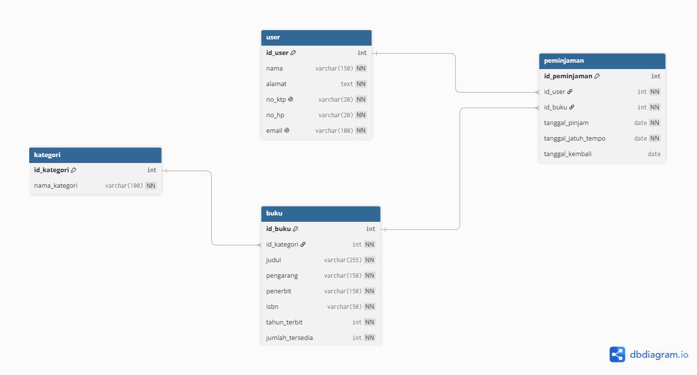

# Software Engineer Pre-Test Submission

Repositori ini berisi penyelesaian tugas technical pre-test yang mencakup 4 bagian: Frontend, Backend Concurrency, Database Design & Query, serta Algorithm.

---

### Daftar Isi
- [Part 1 - Frontend (Knight Move Chessboard)](#part-1---frontend-knight-move-chessboard)
- [Part 2 - Backend (Concurrency & Worker Pool)](#part-2---backend-concurrency--worker-pool)
- [Part 3 - Database (Library Management System)](#part-3---database-library-management-system)
- [Part 4 - Algorithm & Logic (Find Max-Min)](#part-4---algorithm--logic-find-max-min)

---

### Part 1 - Frontend (Knight Move Chessboard)
Simulasi papan catur interaktif berukuran 8x8 yang menghitung dan menandai kemungkinan langkah sah bidak kuda (*Knight*) berdasarkan koordinat petak yang diklik.

* **Lokasi Folder:** `1-frontend/`
* **Tech Stack:** HTML5, CSS Grid, Vanilla JavaScript
* **Cara Menjalankan:** Buka file `1-frontend/index.html` langsung pada browser.

---

### Part 2 - Backend (Concurrency & Worker Pool)
Pemrosesan data secara asinkron dan konkuren menggunakan pola Worker Pool, Goroutines, dan Buffered Channels di Golang dengan jaminan thread-safety via `sync.WaitGroup`.

* **Lokasi Folder:** `2-backend/`
* **Tech Stack:** Go (Golang)
* **Cara Menjalankan:** Masuk ke direktori folder lalu jalankan perintah `go run backend-test.go`.

---

### Part 3 - Database (Library Management System)
Perancangan skema database relasional untuk sistem perpustakaan yang mencakup DDL, DML, relasi data antar-entitas, serta kueri analitis.

* **Lokasi Folder:** `3-sql/`
* **Tech Stack:** MySQL / MariaDB
* **Cara Menjalankan:** Jalankan script `3-sql/database-test-query.sql` secara berurutan (DDL -> DML -> Query Soal) pada PostgreSQL/MySQL client (DBeaver, pgAdmin, atau CLI).

#### Entity Relationship Diagram (ERD)

---

### Part 4 - Algorithm & Logic (Find Max-Min)
Penyelesaian algoritma pencarian nilai maksimum dan minimum dalam array secara efisien menggunakan pendekatan traversal linear / windowing.

* **Lokasi Folder:** `4-algorithm/`
* **File:** `4-algorithm/findMaxInMin.txt`
